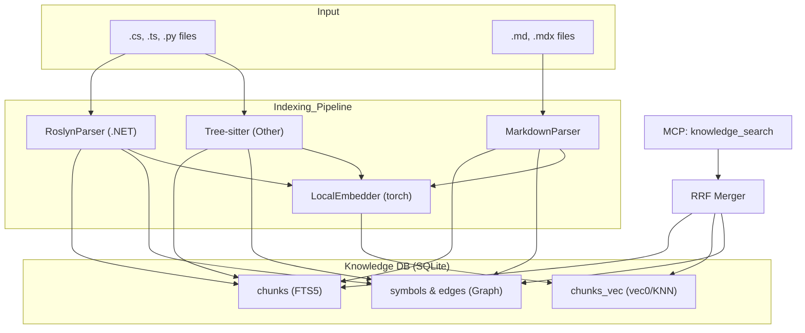

# ADR-002: Гибридное индексирование кодовой базы (Semantic + Graph + Roslyn)

| Метаданные | Значение |
| :--- | :--- |
| **Статус** | Принято |
| **Дата** | 2026-04-16 |
| **Автор** | Root |
| **Затрагивает** | Indexer, Knowledge DB, Search Retrieval, RoslynParser |
| **Breaking Change** | Да (требуется миграция БД и переиндексация) |

---

## Контекст

Обычного полнотекстового поиска (FTS) и простых векторных эмбеддингов недостаточно для качественного поиска по сложным кодовым базам (особенно .NET). Агентам требуется понимание структуры кода: не только что написано, но и как компоненты связаны между собой (кто кого вызывает, кто что наследует).

Ранее (в ADR-001) была заложена основа для локального RAG. Данное решение расширяет её до полноценного гибридного подхода.

---

## Проблема

1. **Низкая точность простого Chunking:** Разбиение кода на чанки по количеству строк часто разрывает контекст функций и классов.
2. **Отсутствие связей:** Векторный поиск находит "похожие" куски, но не может ответить на вопрос "где используется этот метод?" или "какая иерархия у этого класса?".
3. **Особенности .NET:** Для C# требуется глубокий семантический анализ (Roslyn), так как именования и типы данных распределены по множеству файлов и проектов в рамках одного Solution.
4. **Производительность:** Глубокий анализ замедляет индексацию. Нужна параллелизация и эффективное хранение графов.

---

## Решение

Внедрить трехслойную систему индексирования и поиска (Hybrid Triple Search):

### 1. Семантический уровень (Parsing)
- **C# / .NET:** Использование `RoslynParser` (автономное консольное приложение на .NET 8), которое извлекает полное дерево символов, сигнатуры методов и типы. 
- **TS/JS/другие:** Использование `Tree-sitter` через `CodeParser` для извлечения структурных чанков (функции, классы) вместо текстовых.
- **Markdown:** Секционный парсинг (по заголовкам) для сохранения логической целостности документации.

### 2. Графовый уровень (Symbol Graph)
- В БД добавлены таблицы `symbols` и `symbol_edges`.
- Извлекаются связи: `CALLS` (вызовы), `INHERITS` (наследование), `IMPLEMENTS` (реализация), `IMPORTS` (импорты).
- Реализован механизм `unresolved_refs`: ссылки на символы, которые не найдены в текущем файле, сохраняются и разрешаются в конце процесса индексации по всей базе (cross-repo resolution).

### 3. Инфраструктура и производительность
- **Параллелизация:** Хэширование файлов и парсинг вынесены в `ThreadPoolExecutor`.
- **Батч-векторизация:** Эмбеддинги считаются порциями (`sub-batches`) с контролем потребления RAM (важно для контейнеров с лимитом 2-4GB).
- **Транзакционность:** Использование одной большой транзакции SQLite для записи результатов индексации репозитория.

### 4. Ранжирование (RRF)
При поиске результаты из трех каналов объединяются через **Reciprocal Rank Fusion**:
- **FTS5:** Находит точные вхождения имен и терминов.
- **Vector (KNN):** Находит семантически похожие концепции.
- **Graph:** Дает буст (x2) тем чанкам, имена символов в которых точно совпадают с терминами запроса.

---

## Архитектура

---

## Статус

**Принято.** Реализовано в последних коммитах:
- Переход на гибридный поиск (RRF).
- Интеграция Roslyn для .NET.
- Параллельная индексация.
- Графовые инструменты MCP (`knowledge_get_callers`, `knowledge_impact_analysis` и др.).

---

## Ссылки на изменения

- [db.py](file:///c:/Repos/knowlagebase-mcp/knowledge_mcp/db.py) — реализация RRF и графовых запросов.
- [indexer.py](file:///c:/Repos/knowlagebase-mcp/knowledge_mcp/indexer.py) — логика оркестрации парсеров и параллелизации.
- [RoslynParser/](file:///c:/Repos/knowlagebase-mcp/RoslynParser/) — проект на C# для глубокого анализа.
