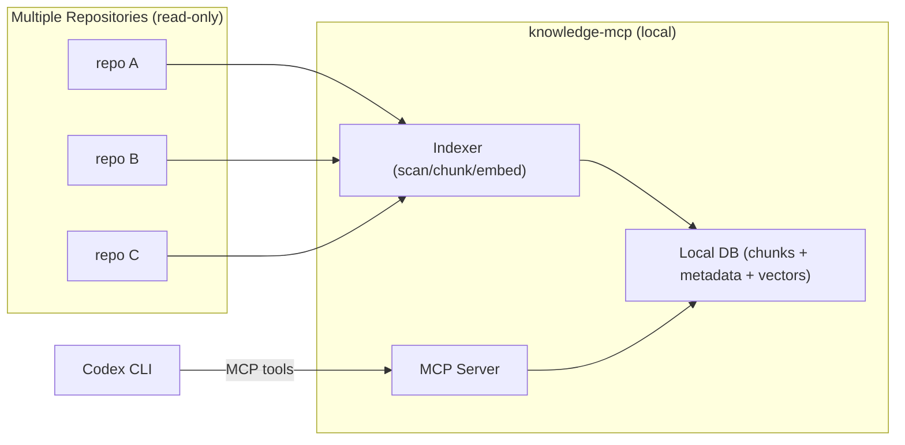

# ADR-001: Local Cross-Repository Knowledge Base (RAG) via MCP

| Metadata | Value |
| :--- | :--- |
| **Status** | Proposed |
| **Date** | 2026-03-19 |
| **Author** | Root |
| **Affects** | Developer Tooling, Codex CLI, MCP, Local Knowledge Base |
| **Breaking Change** | No |

---

## Context

The goal is to provide **cross-repository memory and knowledge retrieval** for an AI assistant (Codex), while keeping the knowledge base **entirely local** (no codebase content sent to external services).

Objective: build a knowledge base that is readable and usable by **AI agents** (RAG retrieval + source citations).

Key principle:
- **Source of truth = the codebase.** The new KB is built from source code (parsing/analysis), not from existing vaults or documentation.
- `docs/` and `knowledge/` directories may be scanned and indexed only as *non-authoritative hints* (e.g., to locate code, terminology, examples), because documentation can lag behind and be incorrect relative to the code.

Trust levels for sources in this repository:
- **Authoritative (required):** source files in `C:\Repos\Yurta.Core.Lib\` (`*.cs`, `*.csproj`, `*.sln`, `*.props`, etc.)
- **Non-authoritative (optional):** `C:\Repos\Yurta.Core.Lib\docs\`, `C:\Repos\Yurta.Core.Lib\knowledge\`

Additional context:
- The repository contains a `C:\Repos\Yurta.Core.Lib\.arscontexta` marker identifying an Ars Contexta vault. Vault hooks are currently disabled (`git: false`, `session_capture: false`), but the knowledge corpus in `C:\Repos\Yurta.Core.Lib\knowledge\` is used as input material.
- The project uses two BMad versions simultaneously: a legacy config at `C:\Repos\Yurta.Core.Lib\.bmad-core\core-config.yaml` and the current config at `C:\Repos\Yurta.Core.Lib\_bmad\core\config.yaml`. In the current BMad version, `project_knowledge` should point to the local knowledge base (e.g., `{project-root}/knowledge`) for grounding.
- Codex does not execute Claude-style slash commands like `/arscontexta:*`; memory access must instead be implemented as MCP tools.

A unified local service is required that:
1. Scans and indexes multiple repositories.
2. Provides a retrieval API for RAG (returning relevant chunks with metadata and source references).
3. Connects to Codex as an MCP server.

---

## Problem

1. **No cross-repository memory for Codex out of the box.** Sessions and context do not form a unified long-term knowledge base across repositories.
2. **The knowledge base must not leave the machine.** An offline/local mode is required — e.g., Docker on a local workstation.
3. **Traceability guarantees are required.** Any retrieved content must be linked to its source: `repo`, `path`, position (lines/range), `commit`/`sha` (where available).
4. **RAG must be practical, not academic.** Real responses should rely on fast search + vector retrieval (hybrid), but the system must gracefully degrade to text-only search when embeddings are unavailable.
5. **Documentation can be incorrect.** `docs/` and `knowledge/` must not be treated as ground truth; retrieved fragments from documentation must be marked as "requires verification" and must not enter the KB as verified facts without code confirmation.

---

## Decision

Create a dedicated repository with a micro-application (`knowledge-mcp`) that runs locally (in Docker) and includes:

1. **Indexer (CLI / Job):**
   - Scans a repository with code-first priority (allowlist of file types).
   - Extracts knowledge from code:
     - Lexical/syntactic analysis (minimum: functions, classes, interfaces, attributes, DI extensions, Options)
     - Cross-entity reference extraction (symbol graph)
     - Builds "fact records" (agent-friendly format), where each fact has a code-backed proof (references)
   - Normalizes findings into chunks in a format optimized for agentic retrieval.
   - Generates metadata: `repo_id`, `path`, `language`, `hash`/`mtime`, `git sha`, `tags`.
   - Computes embeddings (optional) via a local provider.
   - Writes data to a local database.
   - Optionally: scans `docs/` and `knowledge/` as hints, but stores them separately from verified code facts with a reduced trust level.

2. **Store (Local Database):**
   - Default: SQLite (simplicity, portability, volume-friendly).
   - Supports:
     - Full-text search (FTS)
     - Chunk and metadata storage
     - Vector storage (if a vector backend is selected) either via a separate DB/engine or within SQLite.

3. **MCP Server:**
   - Exposes tools to Codex:
     - `knowledge.search(query, repo?, path_glob?, tags?, top_k?)`
     - `knowledge.get_chunk(id)` / `knowledge.get_document(path, repo)`
     - `knowledge.upsert_note(...)` (optional: human annotations on top of indexed facts)
   - Returns results with mandatory source fields (`repo`/`path`/`line_start`/`line_end`/`sha`).
   - Returns trust fields:
     - `source_kind`: `code` | `docs` | `knowledge`
     - `trust`: `verified` (code) | `hint` (documentation)

4. **Docker-first deployment:**
   - `docker compose up -d` starts the service on `127.0.0.1:<port>`.
   - Data is stored in a Docker volume / local directory.
   - The service requires no external network to operate (except optional initial model download).

5. **Multi-repo configuration (required):**
   - Explicit list of repository roots (local paths) + `repo_id`.
   - Mount repositories into the container as read-only volumes (or run the indexer on the host) to avoid copying source files.
   - Incremental indexing per `repo_id` (partial re-index of a selected repository).

---

## Alternatives Considered (and Rejected)

### Option A: Remote hosting (cloud DB + API)
Rejected: contradicts the "no data leaving the machine" requirement.

### Option B: Full-text search only (no embeddings)
Insufficient for code and conceptual queries: BM25/FTS frequently underperforms on recall for semantics-heavy questions.
Acceptable as a fallback when embeddings are unavailable.

### Option C: Use an existing vault (Obsidian/Ars Contexta) without MCP
Insufficient: no standardized retrieval API for connecting to Codex as tools, and no automatic source code indexing or multi-repo support.

---

## Alignment with Current Practices

1. `C:\Repos\Yurta.Core.Lib\knowledge\` and `C:\Repos\Yurta.Core.Lib\docs\` are useful as orientation, but are not treated as ground truth. The new KB is built from code; documents are used only as `hint`.
2. BMad workflows use `project_knowledge` for grounding. Within this ADR it is a source of contextual hints, not truth. Truth is verified against code.
3. `knowledge-mcp` builds a machine-readable KB on top of multiple repos and maintains strict provenance: what was extracted from code vs. what is a hint from documentation.

---

## High-Level Architecture

---

## Requirements

### Functional

1. Index multiple repositories with an explicit `repo_id`.
2. Chunking for:
   - Markdown (by headings/sections)
   - Source files (by size + boundary heuristics, minimum by line count)
3. Hybrid retrieval:
   - Text search (FTS/BM25)
   - Vector search (embeddings)
   - Result fusion (e.g., Reciprocal Rank Fusion)
4. Source fields in all results:
   - `repo_id`, `path`, `line_start`, `line_end`
   - `content` (fragment)
   - `sha` (if the repo is a git repo and sha is available)
5. Ignore/allow configuration:
   - `.git/`, `bin/`, `obj/`, `.idea/`, `.vs/`, `node_modules/`
   - Secret exclusions: `*.pfx`, `*.pem`, `*.key`, `appsettings.*.json` (via denylist)
6. Default source handling (important):
   - Source files are always indexed with `source_kind=code`.
   - `docs/**` and `knowledge/**` by default:
     - Either fully excluded from the index,
     - Or indexed into a separate `hints` collection with `trust=hint` (never mixed with `verified`).
7. KB output format (for agents):
   - Stored as a retrieval-optimized data structure (chunks + metadata + optional vectors).
   - Optionally: export/dump to `jsonl` for autonomous offline agents.
8. Fact provenance:
   - Any fact with `trust=verified` must have at least one code reference (`repo_id`, `path`, `line_start`, `line_end`, `sha`).
   - Facts without references are allowed only as `trust=hint` (e.g., from documentation/README) and must be marked as "requires verification".

### Non-Functional

1. Data locality: the service does not send indexed content outside the machine.
2. Fast incremental re-indexing:
   - Skip unchanged files via `mtime + size` and/or `hash`
3. Observability:
   - Indexing logs (file/chunk counts, parse errors)
4. Simple deployment:
   - Docker Compose, single command to start

---

## Reference Implementation (Guidance)

Not a strict requirement, but a reference point for implementation:

1. Language: Python or Go (fast time-to-delivery).
2. Storage:
   - SQLite + FTS as the baseline.
   - Vectors:
     - Separate backend (e.g., Qdrant in Docker), or
     - Stored in SQLite for a simpler approach (considering size constraints).
3. Embedding providers (plugin):
   - `none` (FTS-only)
   - `ollama` (local; model runs in a separate Docker container)
   - `openai` (strictly optional, disabled by default)

---

## Codex Integration

Codex connects to the MCP server locally.

Expected UX:
1. Start the service: `docker compose up -d`
2. Add the MCP server to Codex CLI (or `~/.codex/config.toml`).
3. In the conversation, ask the assistant to use `knowledge.search`/`knowledge.get_chunk` tools before answering.

---

## Definition of Done

1. `knowledge-mcp` repository with a `docker-compose.yml` that starts the MCP server and local DB (volume).
2. CLI indexing command (or background job) accepting a list of repository configs.
3. Working MCP tools: `knowledge.search` and `knowledge.get_chunk` (minimum).
4. Incremental indexing and basic metrics/logs.
5. Documentation on connecting to Codex and on the local embeddings model (optional).

---

## Referenced Files

Documents and files referenced in the ADR context:
- `C:\Repos\Yurta.Core.Lib\docs\` (project documentation; indexed as input corpus)
- `C:\Repos\Yurta.Core.Lib\knowledge\` (knowledge corpus; indexed as input corpus)
- `C:\Repos\Yurta.Core.Lib\.arscontexta` (Ars Contexta vault marker + local config)
- `C:\Repos\Yurta.Core.Lib\.bmad-core\core-config.yaml` (legacy BMad core config, multi-library context)
- `C:\Repos\Yurta.Core.Lib\_bmad\core\config.yaml` (current BMad core config, including `project_knowledge`)
- `C:\Repos\Yurta.Core.Lib\knowledge\guides\index.md` (entry point of the existing knowledge corpus)

---

## Risks

| Risk | Likelihood | Mitigation |
|------|------------|------------|
| Large data volume, index grows unbounded | Medium | Incremental indexing, TTL for transient chunks, file type limits |
| Secret leakage through the index | Medium | Strict extension and path denylist, optional regex masking |
| Poor retrieval quality without embeddings | High (if disabled) | Hybrid approach + local embedding via Ollama as fallback |
| Docker/runtime dependency on user's machine | Low | Provide both Docker and native run options (optional) |
| Misleading documentation in source repos | Medium | `verified` vs `hint` separation, code-first priority, provenance + code references |

---

## Status

**Proposed.** Next step: create the `knowledge-mcp` repository and implement the baseline (FTS + MCP tools), then extend to hybrid retrieval with local embeddings.
