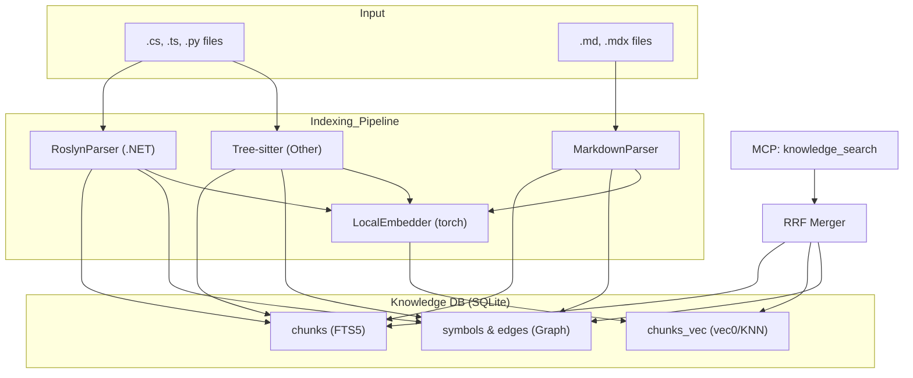

# ADR-002: Hybrid Codebase Indexing (Semantic + Graph + Roslyn)

| Metadata | Value |
| :--- | :--- |
| **Status** | Accepted |
| **Date** | 2026-04-16 |
| **Author** | Root |
| **Affects** | Indexer, Knowledge DB, Search Retrieval, RoslynParser |
| **Breaking Change** | Yes (requires DB migration and full re-indexing) |

---

## Context

Basic full-text search (FTS) and simple vector embeddings are insufficient for high-quality retrieval over complex codebases (especially .NET). Agents require an understanding of code structure — not just what is written, but how components relate to each other (who calls what, who inherits whom).

ADR-001 established the foundation for a local RAG system. This decision extends it to a full hybrid approach.

---

## Problem

1. **Low precision of naive chunking:** Splitting code into fixed-size line chunks often breaks the context of functions and classes.
2. **No relational awareness:** Vector search finds "similar" fragments but cannot answer "where is this method used?" or "what is the inheritance hierarchy of this class?".
3. **.NET specifics:** C# requires deep semantic analysis (Roslyn), because naming and type information is spread across many files and projects within a single Solution.
4. **Performance:** Deep analysis slows down indexing. Parallelization and efficient graph storage are essential.

---

## Decision

Implement a three-layer indexing and search system (Hybrid Triple Search):

### 1. Semantic Layer (Parsing)
- **C# / .NET:** `RoslynParser` — a standalone .NET 8 console application that extracts the full symbol tree, method signatures, and type information.
- **TS/JS/Other:** `Tree-sitter` via `CodeParser` to extract structural chunks (functions, classes) rather than raw text slices.
- **Markdown:** Section-based parsing (by headings) to preserve the logical integrity of documentation.

### 2. Graph Layer (Symbol Graph)
- `symbols` and `symbol_edges` tables added to the database.
- Extracted relationship types: `CALLS`, `INHERITS`, `IMPLEMENTS`, `IMPORTS`.
- `unresolved_refs` mechanism: references to symbols not found in the current file are stored and resolved at the end of the indexing pass across the entire database (cross-repo resolution).

### 3. Infrastructure & Performance
- **Parallelization:** File hashing and parsing offloaded to a `ThreadPoolExecutor`.
- **Batch vectorization:** Embeddings computed in sub-batches with RAM consumption control (critical for containers with 2–4 GB limits).
- **Transactionality:** A single large SQLite transaction used to persist indexing results for a repository.

### 4. Ranking (RRF)
At search time, results from all three channels are merged via **Reciprocal Rank Fusion**:
- **FTS5:** Finds exact name and term matches.
- **Vector (KNN):** Finds semantically similar concepts.
- **Graph:** Applies a ×2 relevance boost to chunks whose symbol names exactly match query terms.

---

## Architecture

---

## Status

**Accepted.** Implemented in recent commits:
- Transition to hybrid search (RRF).
- Roslyn integration for .NET.
- Parallel indexing.
- Graph-based MCP tools (`knowledge_get_callers`, `knowledge_impact_analysis`, etc.).

---

## References

- [db.py](file:///c:/Repos/knowledgebase-mcp/knowledge_mcp/db.py) — RRF implementation and graph queries.
- [indexer.py](file:///c:/Repos/knowledgebase-mcp/knowledge_mcp/indexer.py) — Parser orchestration and parallelization logic.
- [RoslynParser/](file:///c:/Repos/knowledgebase-mcp/RoslynParser/) — C# project for deep semantic analysis.
