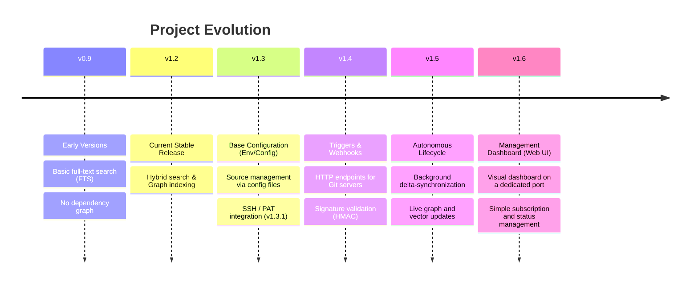

# Roadmap: Autonomous Operation & Trigger Subscriptions

This document outlines the planned evolution of the knowledge base MCP server toward fully autonomous operation — automatically reacting to changes in connected repositories.

Current version: **v1.2**

---

## Roadmap Visualization

---

## v1.3: Base Configuration (Env / Config File)
*Estimate: Minor update (basic settings parsing)*
- Configure subscriptions and triggers via environment variables (`.env`) or a config file (`config.yaml` / `settings.json`).
- Enables autonomous operation at container startup without requiring any visual interface.

## v1.3.1: Update Sources
*Estimate: Patch (extends v1.3 config capabilities)*
- Define source parameters for various origins (primarily Git repositories) in the configuration.
- Manage credentials for secure access to private repositories:
  - SSH key authentication.
  - Personal Access Token (PAT) authentication.

## v1.4: Trigger Configuration
*Estimate: Minor update (new HTTP endpoints and business logic)*
- Define and flexibly select events that trigger automatic knowledge base updates:
  - `Push` (batch of commits) to a target branch (e.g., `master` or `main`).
  - Successful `Merge Request` / `Pull Request` completion.
  - Periodic scheduled updates (Cron).
- Implement authentication mechanisms for incoming webhooks from Git servers:
  - Cryptographic signature validation (e.g., via Shared Secrets / HMAC) as used by GitHub/GitLab, so the system can trust the signal source.

## v1.5: Processing Lifecycle (Integration Flow)
*Estimate: Minor update (system integration and optimization)*
- Routing: bind system triggers to existing internal processes (background repository sync, partial re-indexing of changed files only, removal of stale data).
- Payload parsing: extract relevant file paths from the webhook payload and pass them to the `Indexer` component for optimized delta-sync.

## v1.6: Web Configuration Dashboard (Web UI)
*Estimate: Minor update (major standalone feature)*
- Introduce a web interface as the last layer on top of the existing configuration.
- Launch a lightweight visual UI on a dedicated port (e.g., `8080`) but **within the same container** as the MCP server.
- Implement simple authorization to restrict access to the settings panel and visual subscription management.
